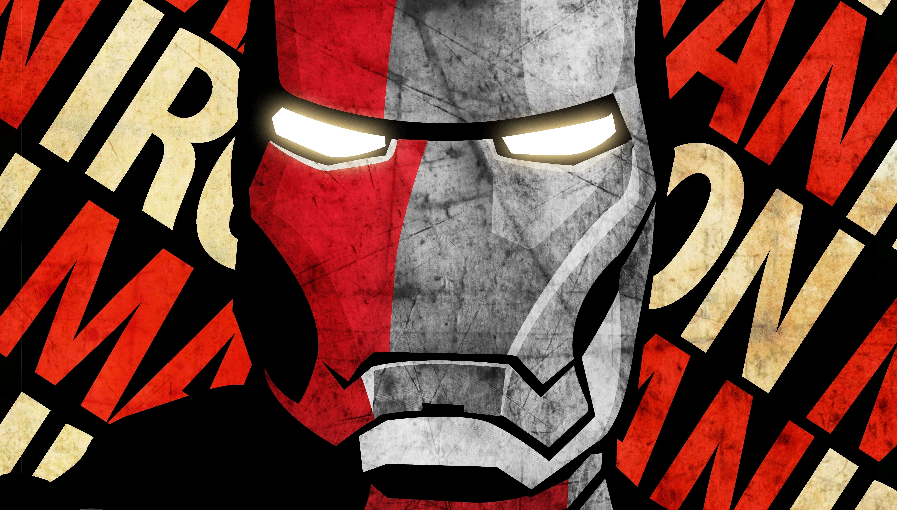

<!DOCTYPE html>
<html lang="en">
<head>
    <meta charset="UTF-8">
    <meta http-equiv="X-UA-Compatible" content="IE=edge">
    <meta name="viewport" content="width=device-width, initial-scale=1.0">
    <title>Dev Website -- Home</title>
    <link rel="stylesheet" href="fhfdjjf.css">
</head>
<body>
    <header>
        <h1>Dev Website</h1>
    </header>
    
    <nav>
        <a target="_blank" href="http://127.0.0.1:5500/main%20page.html">Main Page</a>
        <a href="#">Home</a>
        <a href="#">Search</a>
        <a href="#">Html</a>
        <a href="#">CSS</a>
        <a href="#">Payment</a>
        </nav>

    <main>
        <section>
            <h2>Videos</h2>
            <video src="video/RadhaKrishn -  Ep. 230 - Krishna’s Ultimatum to Radha ( 480 X 854 ).mp4" width="33%" controls poster="image/3973355.jpg"></video>
            <video src="video/RadhaKrishn -  Ep. 231 - Radha, Krishna Makes a Promise ( 480 X 854 ).mp4" width="33%" controls poster="image/3973355.jpg"></video>
            <video src="video/RadhaKrishn -  Ep. 232 - Krishna's Promise to Balaram ( 480 X 854 ).mp4" width="33%" controls poster="image/3973355.jpg"></video>
             
             
             
            <video src="video/RadhaKrishn -  Ep. 233 - Saambh's Evil Resolution ( 480 X 854 ).mp4" width="33%" controls poster="image/3973355.jpg"></video>
            <video src="video/RadhaKrishn -  Ep. 234 - Krishna's Request to Radha ( 480 X 854 ).mp4" width="33%" controls poster="image/3973355.jpg"></video>
            <video src="video/Tum Prem Ho ♥️ Tum Preet Ho  Easy Guitar Tabs  Easy For Beginners  Gol 1080 x 1920.mp4" width="33%" controls poster="image/pexels-north-1407322.jpg"></video>
        </section>

        <section>
            <h2>Coding Tutorial</h2>
            <iframe width="33%" height="63%" src="https://www.youtube.com/embed/sqJ6xZ9mUwE" title="YouTube video player" frameborder="0" allow="accelerometer; autoplay; clipboard-write; encrypted-media; gyroscope; picture-in-picture; web-share" allowfullscreen></iframe>
            <iframe width="33%" height="63%" src="https://www.youtube.com/embed/4nC4VXHlys8" title="YouTube video player" frameborder="0" allow="accelerometer; autoplay; clipboard-write; encrypted-media; gyroscope; picture-in-picture; web-share" allowfullscreen></iframe>
            <iframe width="33%" height="63%" src="https://www.youtube.com/embed/C01LeeMhwHc" title="YouTube video player" frameborder="0" allow="accelerometer; autoplay; clipboard-write; encrypted-media; gyroscope; picture-in-picture; web-share" allowfullscreen></iframe>
        </section>
        

        <section>
       <H1>Cube Solve Tutorial</H1>
       
        <h2></h2>
        </section>

        <section>
            <h2>
                Iron Man
            </h2>
            
            <h3>Tony Stark</h3>
            <a href="http://www.youtube.com/playlist?list=PLfqMhTWNBTe3H6c9OGXb5_6wcc1Mca52n" target="_blank" rel="noopener noreferrer"> Youtube</a>&nbsp;&nbsp; | &nbsp;&nbsp;
            <a href="http://www.youtube.com" target="_blank" rel="noopener noreferrer"> Youtube Web Development</a>&nbsp;&nbsp; | &nbsp;&nbsp;
            <a href="http://www.youtube.com/watch?v=UmnCZ7-9yDY" target="_blank" rel="noopener noreferrer"> Youtube Java Coding</a>

            
            <h2>Iron Man · Movie plot</h2>
            <h4>     
Tony Stark. Genius, billionaire, playboy, philanthropist. Son of legendary inventor and weapons contractor Howard Stark. When Tony Stark is assigned to give a weapons presentation to an Iraqi unit led by Lt. Col. James Rhodes, he's given a ride on enemy lines. That ride ends badly when Stark's Humvee that he's riding in is attacked by enemy combatants. He survives - barely - with a chest full of shrapnel and a car battery attached to his heart. In order to survive he comes up with a way to miniaturize the battery and figures out that the battery can power something else. Thus Iron Man is born. He uses the primitive device to escape from the cave in Iraq. Once back home, he then begins work on perfecting the Iron Man suit. But the man who was put in charge of Stark Industries has plans of his own to take over Tony's technology for other matters.
            </h4>
        </section>
    </main>

    <footer>
        <a href="#"> FAQ</a>
        <a href="#"> Contact Us</a>
        <a href="#"> Teurms of Use</a>
        <a href="#"> Privacy Policy</a>
        <a href="#"> Refund Policy</a>
        <a href="#"> &copy; | 2023 Dev Website</a>
    </footer>
    
</body>
</html>
